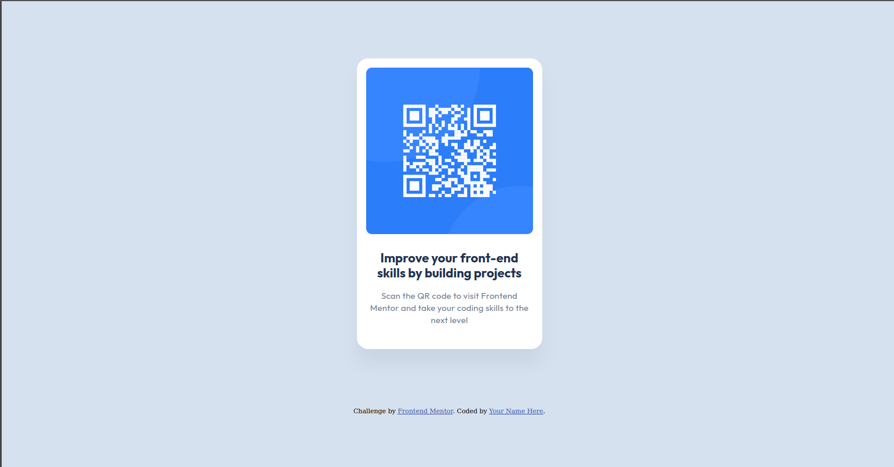

# Frontend Mentor - QR code component solution

## Table of contents

- [Overview](#overview)
  - [Screenshot](#screenshot)
  - [Links](#links)
- [My process](#my-process)
  - [Built with](#built-with)
  - [What I learned](#what-i-learned)
  - [Continued development](#continued-development)
  - [Useful resources](#useful-resources)
  - [AI Collaboration](#ai-collaboration)
- [Author](#author)

## Overview

### Screenshot

### Links

- Solution URL: [GitHub Repository](https://github.com/akissi22/qr-code-component)

## My process

Before writing any code, I analyzed the design carefully to identify all the elements and how they were arranged. I then structured the HTML first, then added styles progressively from parent to child elements.

### Built with

- Semantic HTML5
- CSS3
- CSS custom properties (variables)
- Flexbox

### What I learned

- To center content on the full viewport, you need `justify-content: center` and `align-items: center` combined with `min-height: 100vh` on the parent element.
- Extra wrapper divs are not always necessary — the parent element can often handle layout on its own.
- Analyzing the design carefully before coding saves time and avoids unnecessary rework.
- Keeping code organized and using CSS variables avoids repetition and makes styles easier to maintain.

### Continued development

I want to continue practicing Flexbox and responsive design in my next projects.

### Useful resources

- [MDN Web Docs](https://developer.mozilla.org) - Great reference for HTML and CSS properties.

### AI Collaboration

I used Claude as a learning mentor throughout this challenge. It helped me think through problems step by step rather than giving me direct answers, which made the learning experience much more valuable.

## Author

- Frontend Mentor - [@akissi22](https://www.frontendmentor.io/profile/akissi22)
